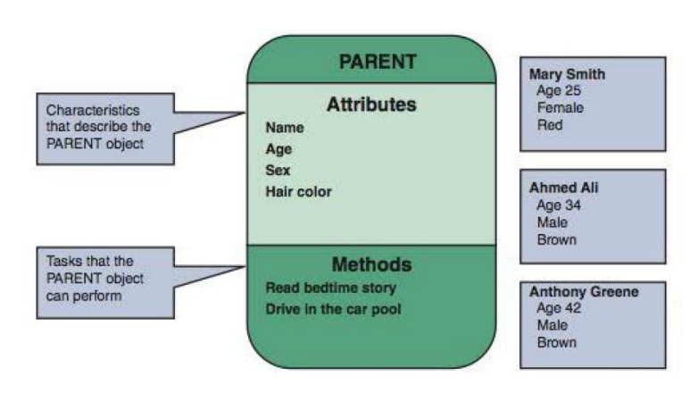
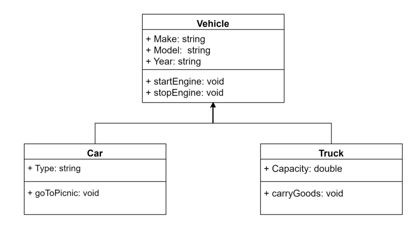

# Unified Modeling Language (UML)
Unified Modeling Language (UML) is a general-purpose modeling language. The main aim of UML is to define a standard way to visualize the way a system has been designed. It is quite similar to blueprints used in other fields of engineering. UML is not a programming language, it is rather a visual language. UML diagrams are normally used to show the behavior and structure of a system. UML helps software engineers, businessmen, and system architects with modeling, design, and analysis.

## Need of UML
UMLs are normally used to simplify the technical language into visual language for non-technical people. Below are some of cases where UMLs are needed:
- Complex applications need collaboration and planning from multiple teams and hence require a clear and concise way to communicate amongst them.
- Businessmen do not understand code. So UML becomes essential to communicate with non-programmers about essential requirements, functionalities, and processes of the system.
- A lot of time is saved down the line when teams can visualize processes, user interactions, and the static structure of the system.

## Types of UML Diagrams
UML diagrams come in several forms:
- Structural Diagrams
  - Class Diagram
  - Component Diagram
  - Deployment Diagram
  - Object Diagram
- Behavioral Diagram
  - Use Case Diagram
  - Sequence Diagram
  - Activity Diagram
  - State Diagram

## Class Diagram
The most widely use UML diagram is the class diagram. It is the building block of all object oriented software systems. We use class diagrams to depict the static structure of a system by showing system's classes, their methods and attributes. Class diagrams also help us identify relationship between different classes or objects. Below is an example of a class Diagram:

### Relationships in Classes
In a class diagram, relationships (parent and child) can be shown as well. Below is an example of a parent child relationship where `Vehicle` is a parent class and `Car` and `Truck` are child classes:

In the above diagram `+` depicts a `public` access modifier. `-` is normally used for `private` and `#` is used for `protected`.

## Exercise 1
CMU Medical Clinic is a general purpose clinic. Patients have to book an appointment to see the doctors. Patients contact Office Staff to book or change an appointment.
- Tasks
  - Identify the classes
  - Create a Class Diagram for Book or Change Appointment
  - Notify doctor about the appointment
 
### Solution

## Exercise 2
CMU Course Registration system enables students to register for courses. Students use this system to enroll in the courses offered by CMU.
- Tasks
  - Identify the classes
  - Create a Class Diagram for course registration
  - Send registration confirmation to student

### Solution

